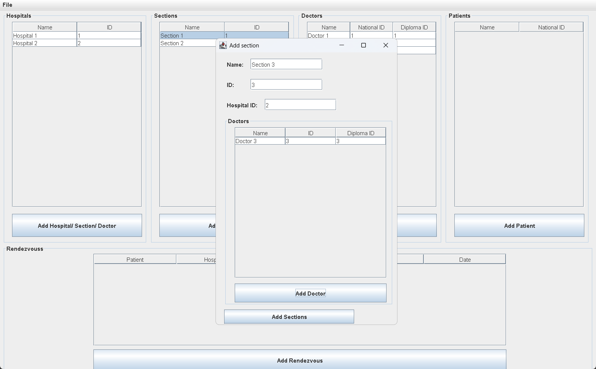
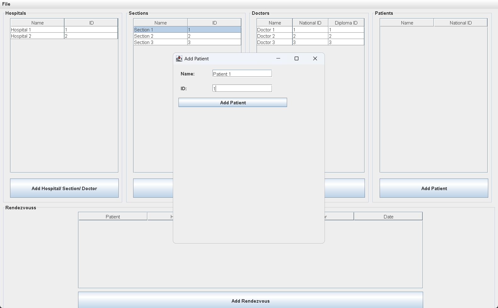

# Clinic Reservation Information System

## Purpose

The main goal of this application is to manage a small clinic or hospital without distractions. It is built with Java Swing and designed with a minimal and intuitive user interface for a smooth user experience.

## Features

- Add hospitals, sections, doctors, and patients
- Patients can make reservations with specific doctors
- Save data to a serialized `.dat` file
- Load previously saved data

## How to Use

Using the application is straightforward:
- To add a new item (hospital, section, doctor, or patient), simply click the corresponding button and enter the required information.

## Screenshots

### Main Screen  

### Add Section Example  

### Add Patient Example  

